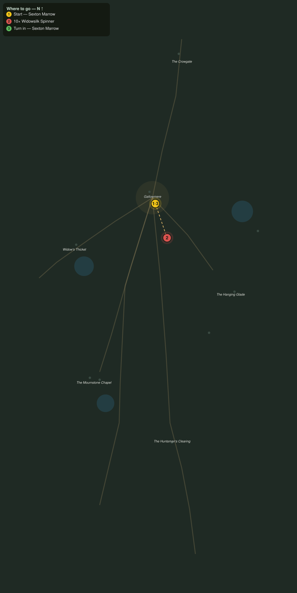

# Silk in the Eaves

> Quest ID: `q_ww_silk_in_the_eaves` · The Wraithwood

| | |
|---|---|
| **Recommended level** | 20+ (zone range 20–20) |
| **Quest giver** | **Sexton Marrow**, Sexton of Gallowmere _(at ~x:363, z:1436)_ |
| **Turn in to** | **Sexton Marrow**, Sexton of Gallowmere _(at ~x:363, z:1436)_ |
| **Requires** | The Bells of Gallowmere (`q_ww_bells_of_gallowmere`) |

## Story

> Look up when you walk the west road, <your name>, and you will see them: wrapped shapes in the canopy, swaying where no wind reaches. The widowsilk spinners have crept out of the Thicket and strung their larders over my lanterns. Kill ten, and the road is a road again.

## How to complete

- **Kill 10× [Widowsilk Spinner](bestiary.md#mob-widowsilk_spinner)** (level 20–20)
  - Found in the open world at ~x:282, z:1478 (3 mobs, radius 10)
  - Found in the open world at ~x:468, z:1464 (3 mobs, radius 10)
  - _Tracker: Widowsilk Spinner slain_

Then return to **Sexton Marrow**, Sexton of Gallowmere _(at ~x:363, z:1436)_ to turn in.

## Rewards

- **XP:** 4600
- **Money:** 2200 copper

## On completion

> Ten fewer weavers in the eaves. The lamplighters will walk their rounds tonight without looking up, and that is worth more here than you know.

## Leads to

- The Last Vicar (`q_ww_the_last_vicar`)

## Where to go

**[🧭 Open this route in 3D →](#/questroute/q_ww_silk_in_the_eaves)**

_Numbered route: ① start → objectives → 3 turn in. Faint dots are the rest of the zone for context — see the [full zone map](README.md). Mob names above link to the [bestiary](bestiary.md)._
