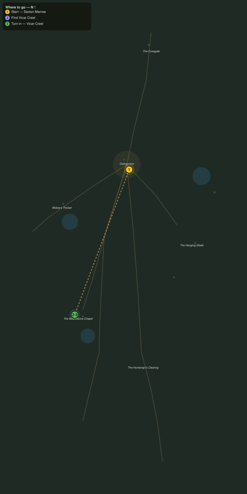

# The Last Vicar

> Quest ID: `q_ww_the_last_vicar` · The Wraithwood

| | |
|---|---|
| **Recommended level** | 20+ |
| **Quest giver** | **Sexton Marrow**, Sexton of Gallowmere _(at ~x:363, z:1436)_ |
| **Turn in to** | **Vicar Creel**, Last Vicar of the Mournstone _(at ~x:296, z:1614)_ |
| **Requires** | Silk in the Eaves (`q_ww_silk_in_the_eaves`) |

## Story

> South of here the Mournstone Chapel moulders by its black tarn, and one man still tends it: Vicar Creel, who would not leave when the roof came down. He knows the old rites better than my bells do, <your name>, and he has not sent word in a month. Walk the chapel road and see him breathing.

## How to complete

- **Interact with **Vicar Creel**, Last Vicar of the Mournstone _(at ~x:296, z:1614)_**
  - _Tracker: Find Vicar Creel_

Then return to **Vicar Creel**, Last Vicar of the Mournstone _(at ~x:296, z:1614)_ to turn in.

## Rewards

- **XP:** 2800
- **Money:** 1100 copper

## On completion

> Marrow worries after me? That is new. Tell him the Mournstone stands, after a fashion, and so do I. Stay a while, $N. The tarn has been whispering, and I would rather not listen alone.

## Leads to

- Wraiths of the Tarn (`q_ww_wraiths_of_the_tarn`)
- What the Bark Holds (`q_ww_what_the_bark_holds`)
- Walking Mosley Home (`q_ww_walking_mosley_home`)

## Where to go

**[🧭 Open this route in 3D →](#/questroute/q_ww_the_last_vicar)**

_Numbered route: ① start → objectives → 3 turn in. Faint dots are the rest of the zone for context — see the [full zone map](README.md). Mob names above link to the [bestiary](bestiary.md)._
