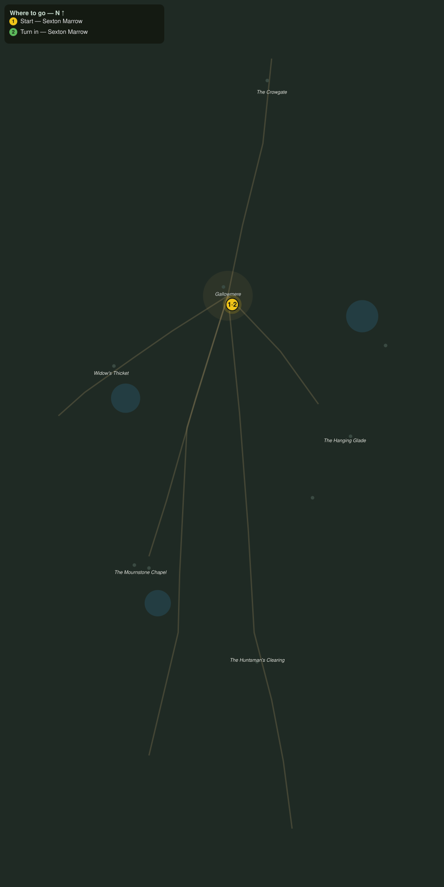

# Walking Mosley Home

> Quest ID: `q_ww_walking_mosley_home` · The Wraithwood

| | |
|---|---|
| **Recommended level** | 20+ |
| **Quest giver** | **Sexton Marrow**, Sexton of Gallowmere _(at ~x:363, z:1436)_ |
| **Turn in to** | **Sexton Marrow**, Sexton of Gallowmere _(at ~x:363, z:1436)_ |
| **Requires** | The Last Vicar (`q_ww_the_last_vicar`) |

## Story

> My gravedigger Mosley took the chapel road three days ago to open a plot in the old yard, and the dig came down on top of him. He clawed his way out, the fool is alive, but he is huddled by the chapel graves and will not move for spinners on the road. Walk him home, <your name>. I cannot ring the bells for a living man.

## How to complete

  - _Tracker: Gravedigger Mosley walked safely back to Gallowmere_

Then return to **Sexton Marrow**, Sexton of Gallowmere _(at ~x:363, z:1436)_ to turn in.

## Rewards

- **XP:** 5600
- **Money:** 3200 copper

## On completion

> He came through the gate on his own two feet, swearing he will dig nothing deeper than a turnip bed from now on. He will be back at the yard by Sunday, they always are. Thank you, $N. Gallowmere keeps its people, that is the whole of our law.

## Where to go

**[🧭 Open this route in 3D →](#/questroute/q_ww_walking_mosley_home)**

_Numbered route: ① start → objectives → 3 turn in. Faint dots are the rest of the zone for context — see the [full zone map](README.md). Mob names above link to the [bestiary](bestiary.md)._
