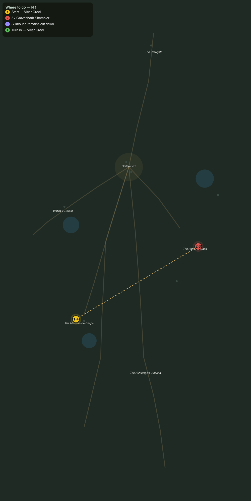

# What the Bark Holds

> Quest ID: `q_ww_what_the_bark_holds` · The Wraithwood

| | |
|---|---|
| **Recommended level** | 20+ (zone range 20–20) |
| **Quest giver** | **Vicar Creel**, Last Vicar of the Mournstone _(at ~x:296, z:1614)_ |
| **Turn in to** | **Vicar Creel**, Last Vicar of the Mournstone _(at ~x:296, z:1614)_ |
| **Requires** | The Last Vicar (`q_ww_the_last_vicar`) |

## Story

> In the Hanging Glade east of Gallowmere the spinners hang their silk-wrapped dead from the boughs, and the gravenbark shamblers stand guard beneath like patient pallbearers. Those are our people up there, <your name>. Break five shamblers, cut down three of the wrapped dead, and bring them home to soil.

## How to complete

- **Kill 5× [Gravenbark Shambler](bestiary.md#mob-gravenbark_shambler)** (level 20–20)
  - Found in the open world at ~x:444, z:1526 (2 mobs, radius 10)
  - _Tracker: Gravenbark Shambler felled_
- **Interact 3× with Silkbound Remains**
  - Locations: ~x:432, z:1516 · ~x:446, z:1536 · ~x:438, z:1544
  - _Tracker: Silkbound remains cut down_

Then return to **Vicar Creel**, Last Vicar of the Mournstone _(at ~x:296, z:1614)_ to turn in.

## Rewards

- **XP:** 5200
- **Money:** 2800 copper

## On completion

> Three souls back under honest ground before nightfall. The shamblers will grow back, bark always does, but tonight the glade hangs empty, and that is enough.

## Leads to

- The Horn of the Huntsman (`q_ww_horn_of_the_huntsman`)

## Where to go

**[🧭 Open this route in 3D →](#/questroute/q_ww_what_the_bark_holds)**

_Numbered route: ① start → objectives → 4 turn in. Faint dots are the rest of the zone for context — see the [full zone map](README.md). Mob names above link to the [bestiary](bestiary.md)._
