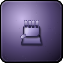
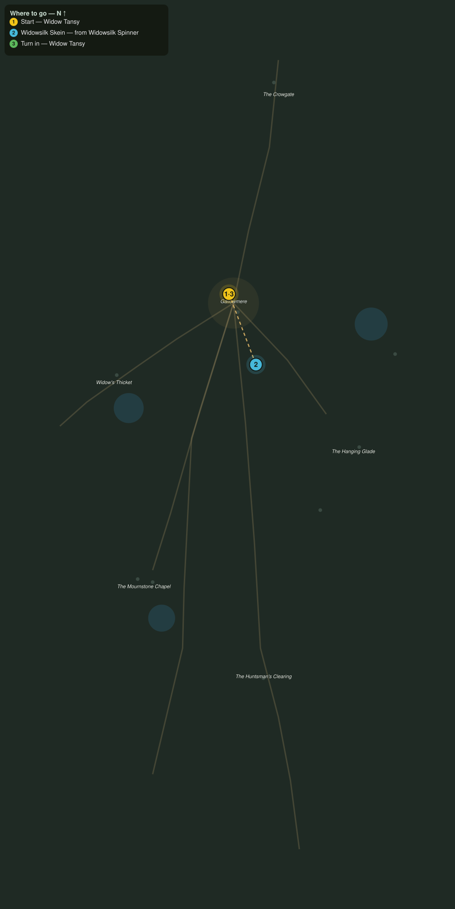

# The Widow's Skeins

> Quest ID: `q_ww_widows_skeins` · The Wraithwood

| | |
|---|---|
| **Recommended level** | 20+ (zone range 20–20) |
| **Quest giver** | **Widow Tansy**, Candlewright of Gallowmere _(at ~x:357, z:1424)_ |
| **Turn in to** | **Widow Tansy**, Candlewright of Gallowmere _(at ~x:357, z:1424)_ |
| **Requires** | The Bells of Gallowmere (`q_ww_bells_of_gallowmere`) |

## Story

> The spinners take our dead for their larders, <your name>, so I take their silk for our shrouds. It burns clean and it holds a blessing better than linen ever did. Bring me six skeins of widowsilk, and the next soul we bury goes down wrapped and warded.

## How to complete

- **Collect 6× Widowsilk Skein**
  - Drops from [**Widowsilk Spinner**](bestiary.md#mob-widowsilk_spinner) (60% chance) — Found in the open world at ~x:282, z:1478 (3 mobs, radius 10); Found in the open world at ~x:468, z:1464 (3 mobs, radius 10)
  - _Tracker: Widowsilk Skein_

Then return to **Widow Tansy**, Candlewright of Gallowmere _(at ~x:357, z:1424)_ to turn in.

## Rewards

- **XP:** 4800
- **Money:** 2400 copper
- **Item reward (by class):**
  -  🟢 Gravebound Silk Wraps — _warrior, mage, rogue_ · 52 armor, +3 Sta, +3 Spi

## On completion

> Six skeins, soft as a held breath. The dead will lie easier in this. Take these wraps, I sewed them from the last batch, and the wood has never once bitten through them.

## Where to go

**[🧭 Open this route in 3D →](#/questroute/q_ww_widows_skeins)**

_Numbered route: ① start → objectives → 3 turn in. Faint dots are the rest of the zone for context — see the [full zone map](README.md). Mob names above link to the [bestiary](bestiary.md)._
