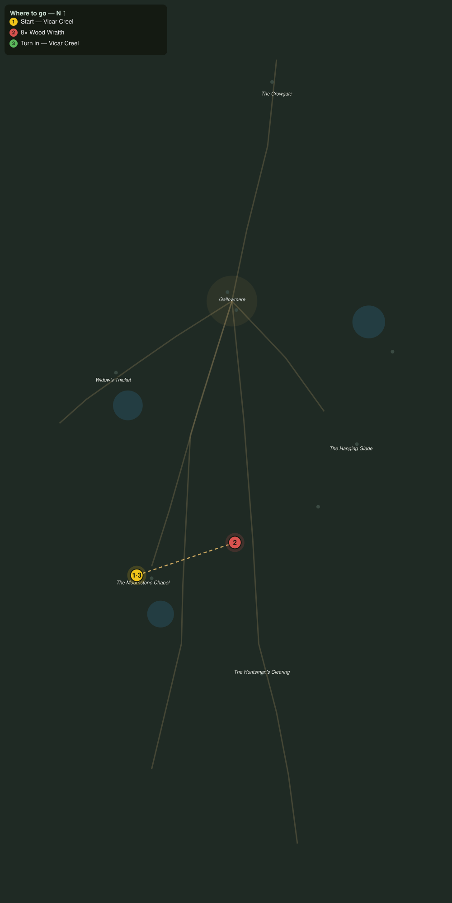

# Wraiths of the Tarn

> Quest ID: `q_ww_wraiths_of_the_tarn` · The Wraithwood

| | |
|---|---|
| **Recommended level** | 20+ (zone range 20–20) |
| **Quest giver** | **Vicar Creel**, Last Vicar of the Mournstone _(at ~x:296, z:1614)_ |
| **Turn in to** | **Vicar Creel**, Last Vicar of the Mournstone _(at ~x:296, z:1614)_ |
| **Requires** | The Last Vicar (`q_ww_the_last_vicar`) |

## Story

> The wood wraiths were the chapel wardens once, <your name>, grown from trees planted over the honored dead. Since the tarn turned black they have forgotten their office, and now they drift through my graveyard pulling at the soil. Break eight of them apart before they finish what they have started.

## How to complete

- **Kill 8× [Wood Wraith](bestiary.md#mob-wood_wraith)** (level 20–20)
  - Found in the open world at ~x:306, z:1616 (3 mobs, radius 9)
  - Found in the open world at ~x:418, z:1568 (3 mobs, radius 10)
  - _Tracker: Wood Wraith slain_

Then return to **Vicar Creel**, Last Vicar of the Mournstone _(at ~x:296, z:1614)_ to turn in.

## Rewards

- **XP:** 4800
- **Money:** 2400 copper

## On completion

> Eight wardens laid down at last. I will not call it a mercy in daylight, but between us, $N, it was one.

## Where to go

**[🧭 Open this route in 3D →](#/questroute/q_ww_wraiths_of_the_tarn)**

_Numbered route: ① start → objectives → 3 turn in. Faint dots are the rest of the zone for context — see the [full zone map](README.md). Mob names above link to the [bestiary](bestiary.md)._
