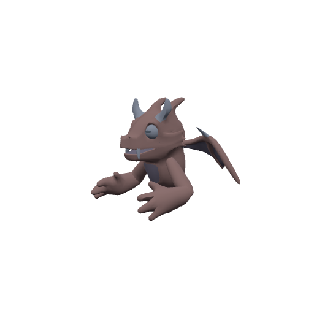
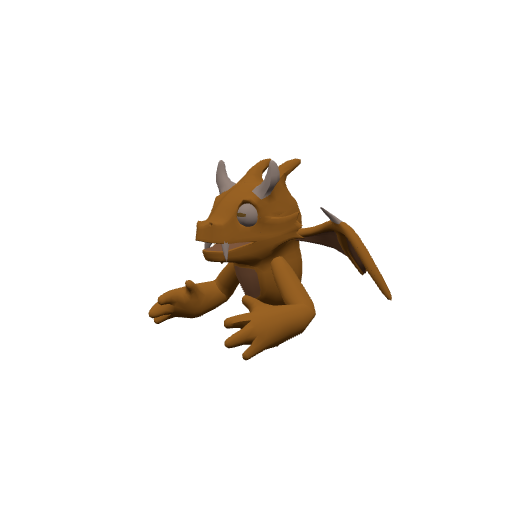
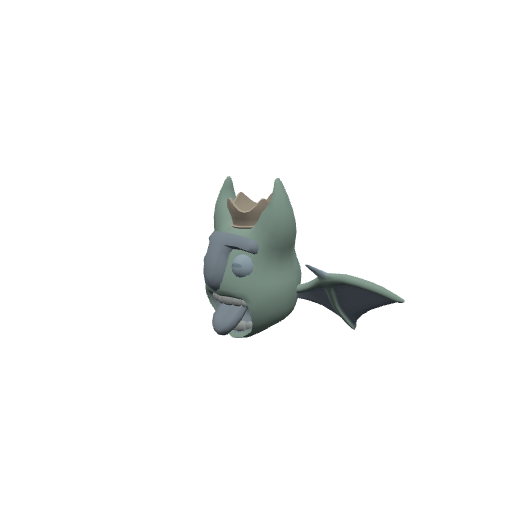
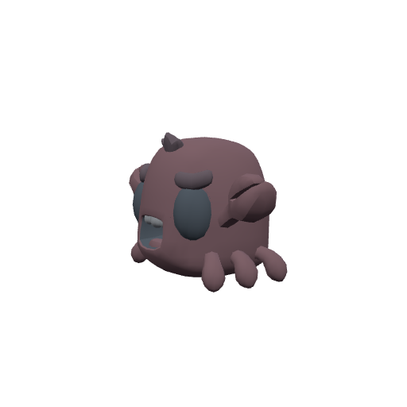

# Bosses & Encounters

Creatures from scripted fights, raids, and roaming/world spawns that don't belong to a single open-world camp. (Summoned warlock pets live on the [Warlock demons](warlock-demons.md) page; instanced bosses also appear on [Raids & dungeons](raids-and-dungeons.md).)

### Abyssal Maw 🟡 Boss

**Level 18–23 · 2080 HP · Mudfin**

**Drops:** Abyssal Loop _(35%)_, Rift Essence _(100%)_, Rift Essence _(50%)_

 

### Archon Nyxaris 🟡 Boss

**Level 18–23 · 2014 HP · Humanoid**

**Drops:** Voidscar Handwraps _(35%)_, Rift Essence _(100%)_, Rift Essence _(50%)_

 

### Bonelord Xarreth 🟡 Boss

**Level 18–23 · 2080 HP · Undead**

**Drops:** Bonelord Mantle _(35%)_, Rift Essence _(100%)_, Rift Essence _(50%)_

 

### Broodmother Vysska 🟡 Boss

**Level 18–23 · 2014 HP · Spider**

**Drops:** Broodmother Carapace _(35%)_, Rift Essence _(100%)_, Rift Essence _(50%)_

 

### Hoarfrost Warden 🟡 Boss

**Level 18–23 · 2080 HP · Undead**

**Drops:** Hoarfrost Edge _(35%)_, Rift Essence _(100%)_, Rift Essence _(50%)_

 

### Tempest Vharok 🟡 Boss

**Level 18–23 · 2212 HP · Dragonkin**

**Drops:** Stormscale Treads _(35%)_, Rift Essence _(100%)_, Rift Essence _(50%)_

 

### Warlord Grask 🟡 Boss

**Level 18–23 · 2430 HP · Ogre**

**Drops:** Graskbreaker Girdle _(35%)_, Rift Essence _(100%)_, Rift Essence _(50%)_

 

### Ysolei, Avatar of the Drowned Moon 🟡 Boss

**Level 18 · 984 HP · Dragonkin**

**Drops:** Ysolei's Pearl Greaves _(50%)_, Moonwrack Breastplate _(34%)_, Moonwrack Robe _(33%)_, Moonwrack Tunic _(33%)_

 

### The Bound Guardian 🟡 Boss

**Level 20 · 1270 HP · Undead**

**Drops:** King's Signet _(100%)_

 

### Thunzharr, the Waking Peak 🟡 Boss

**Level 20 · 20000 HP · Elemental**

**Drops:** Inert Storm Shard _(100%)_, Bonewrought Gauntlets _(8%)_, Direfang Grips _(8%)_, Wraithfire Gloves _(8%)_, Galecall Handguards _(8%)_, Bonewrought Girdle _(8%)_

 

### Zulgar, Voice of the Basin 🟡 Boss

**Level 20 · 1550 HP · Troll**

**Drops:** Bone Fragments _(80%)_, Wildheart Tuskblade _(6%)_, Hexwood Staff of the Basin _(6%)_, Fangknife of Zulgar _(6%)_

 

### Boarball

**Level 1 · 1 HP · Beast**

 

### Water Elemental

**Level 1–60 · 880 HP · Elemental**

 

### Yumi

**Level 1–60 · 5000 HP · Beast**

 

### Fisher Bram

**Level 5 · 195 HP · Humanoid**

 

### Mogger Lackey

**Level 5–6 · 152 HP · Humanoid**

 

### Grix the Tunnelking 🔶 Elite

**Level 7 · 644 HP · Burrower**

**Drops:** Greasy Tallow Lump _(100%)_, Lesser Healing Potion _(100%)_, Tunnelking's Spade _(30%)_, Mogger's Copper Cudgel _(25%)_, Hollowbone Hauberk _(25%)_, Briarroot Staff _(30%)_

 

### Raised Bonewalker

**Level 7–8 · 76 HP · Undead**

 

### Wraithbinder Maldrec 🔶 Elite

**Level 7 · 740 HP · Undead**

**Drops:** Bone Fragments _(100%)_, Maldrec's Soulbinder _(25%)_, Hollowbone Hauberk _(25%)_, Gravewoven Raiment _(25%)_, Gravestalker Jerkin _(25%)_

 

### Acolyte Tessa

**Level 8 · 183 HP · Humanoid**

 

### Mirejaw Frenzy

**Level 9–10 · 228 HP · Mudfin**

 

### Drowned Thrall

**Level 11 · 194 HP · Undead**

 

### Nhalia Mourner

**Level 11–12 · 250 HP · Humanoid**

 

### Spider Egg-Sac

**Level 12–13 · 1 HP · Beast**

 

### Edda Reedhand

**Level 13 · 266 HP · Humanoid**

 

### Tolling Bell

**Level 14 · 1 HP · Undead**

 

### Ironvein Sapper

**Level 15–16 · 378 HP · Burrower**

 

### Drowned Templeguard 🔶 Elite

**Level 16–17 · 432 HP · Undead**

**Drops:** Bone Fragments _(60%)_, Pale Pearl _(40%)_

 

### Glimmerscale Lurker 🔶 Elite

**Level 16–17 · 413 HP · Spider**

**Drops:** Twitching Spider Leg _(50%)_, Moonpale Scale _(40%)_

 

### Moonspawn

**Level 16 · 284 HP · Mudfin**

 

### Pale Choir Acolyte 🔶 Elite

**Level 16–17 · 411 HP · Humanoid**

**Drops:** Linen Scrap _(40%)_, Briny Idol _(30%)_

 

### Pearlguard Sentinel 🔶 Elite

**Level 17–18 · 478 HP · Elemental**

**Drops:** Pale Pearl _(60%)_, Moonpale Scale _(40%)_

 

### Apprentice Wren

**Level 18 · 600 HP · Humanoid**

 

### Boneclad Warrior 🔶 Elite

**Level 18–23 · 562 HP · Undead**

**Drops:** Bonelord Mantle _(2%)_, Rift Essence _(5%)_

 

### Choirmother Selthe 🔶 Elite

**Level 18 · 618 HP · Humanoid**

**Drops:** Selthe's Sea-Striders _(40%)_, Briny Idol _(50%)_

 

### Deep Lurker 🔶 Elite

**Level 18–23 · 485 HP · Burrower**

**Drops:** Abyssal Loop _(2%)_, Rift Essence _(5%)_

 

### Frostbound Revenant 🔶 Elite

**Level 18–23 · 510 HP · Undead**

**Drops:** Hoarfrost Edge _(2%)_, Rift Essence _(5%)_

 

### Magma Brute 🔶 Elite

**Level 18–23 · 564 HP · Elemental**

**Drops:** Emberforge Gauntlets _(2%)_, Rift Essence _(5%)_

 

### Magus Vel'Kor the Pactbound 🔶 Elite

**Level 18–23 · 1300 HP · Undead**

**Drops:** Pactbound Vestments _(45%)_, Rift Essence _(100%)_, Rift Essence _(100%)_

 

### Marrow Troll 🔶 Elite

**Level 18–23 · 591 HP · Troll**

**Drops:** Bonelord Mantle _(2%)_, Rift Essence _(5%)_

 

### Pact Acolyte 🔶 Elite

**Level 18–23 · 435 HP · Undead**

**Drops:** Pactbound Vestments _(2%)_, Rift Essence _(5%)_

 

### Raised Bonewalker

**Level 18 · 312 HP · Undead**

 

### Rime Elemental 🔶 Elite

**Level 18–23 · 537 HP · Elemental**

**Drops:** Hoarfrost Edge _(2%)_, Rift Essence _(5%)_

 

### Risen Bonewalker

**Level 18–23 · 310 HP · Undead**

 

### Stone Ogre 🔶 Elite

**Level 18–23 · 616 HP · Ogre**

**Drops:** Graskbreaker Girdle _(2%)_, Rift Essence _(5%)_

 

### Storm Caller 🔶 Elite

**Level 18–23 · 510 HP · Elemental**

**Drops:** Stormscale Treads _(2%)_, Rift Essence _(5%)_

 

### Stormscale Drake 🔶 Elite

**Level 18–23 · 589 HP · Dragonkin**

**Drops:** Stormscale Treads _(2%)_, Rift Essence _(5%)_

 

### Thornback Stalker 🔶 Elite

**Level 18–23 · 512 HP · Beast**

**Drops:** Broodmother Carapace _(2%)_, Rift Essence _(5%)_

 

### Tide Thrall 🔶 Elite

**Level 18–23 · 512 HP · Mudfin**

**Drops:** Abyssal Loop _(2%)_, Rift Essence _(5%)_

 

### Varkas Boneguard

**Level 18–19 · 482 HP · Undead**

 

### Venom Weaver 🔶 Elite

**Level 18–23 · 460 HP · Spider**

**Drops:** Broodmother Carapace _(2%)_, Rift Essence _(5%)_

 

### Voidscar Acolyte 🔶 Elite

**Level 18–23 · 460 HP · Humanoid**

**Drops:** Voidscar Handwraps _(2%)_, Rift Essence _(5%)_

 

### Roused Stormling

**Level 19–20 · 550 HP · Elemental**

 

### Terrace Howler

**Level 19–20 · 508 HP · Beast**

 

### Barrow Wight

**Level 20 · 510 HP · Undead**

**Drops:** Bone Fragments _(50%)_

 

### Bloodmane Ravager 🔶 Elite

**Level 20 · 628 HP · Troll**

 

### Cindraleth the Maw Matriarch 🔶 Elite

**Level 20 · 890 HP · Dragonkin**

 

### Corrupted Priest Malric 🔶 Elite

**Level 20 · 1720 HP · Undead**

**Drops:** Crypt Keystone Lower _(100%)_, Frayed Prayer Beads _(50%)_, Cryptbloom Shoulderguards _(20%)_

 

### Dawnhold Knight

**Level 20 · 462 HP · Humanoid**

**Drops:** Linen Scrap _(30%)_

 

### Deathstalker Voss 🔶 Elite

**Level 20 · 1890 HP · Undead**

**Drops:** Ancient Diary _(100%)_, Bone Fragments _(100%)_

 

### Drowned Deckhand

**Level 20 · 438 HP · Undead**

**Drops:** Bone Fragments _(50%)_

 

### Fallen Captain Aldren 🔶 Elite

**Level 20 · 1830 HP · Undead**

**Drops:** Crypt Keystone Upper _(100%)_, Bone Fragments _(100%)_

 

### Fanglord Beastmaster 🔶 Elite

**Level 20 · 870 HP · Troll**

 

### Gale Wisp

**Level 20 · 412 HP · Elemental**

 

### Gravedigger Mosley

**Level 20 · 640 HP · Humanoid**

 

### Navigator Suli

**Level 20 · 640 HP · Humanoid**

 

### Risen Royal Guard 🔶 Elite

**Level 20 · 710 HP · Undead**

 

### Shoal Scuttler

**Level 20 · 436 HP · Beast**

 

### Spirit of Aldren 🔶 Elite

**Level 20 · 710 HP · Undead**

 

### Spirit of Malric 🔶 Elite

**Level 20 · 360 HP · Undead**

 

### Spirit of Voss 🔶 Elite

**Level 20 · 410 HP · Undead**

 

### Sunbone Hexcaller 🔶 Elite

**Level 20 · 480 HP · Troll**

 

### The Meredark 🔶 Elite

**Level 20 · 720 HP · Murloc**

**Drops:** Slimy Mudfin Scale _(100%)_

 

### Vineclaw Stalker 🔶 Elite

**Level 20 · 502 HP · Troll**

 

### Vision of Captain Aldren

**Level 20 · 1 HP · Humanoid**

 

### Vision of High Priest Malric

**Level 20 · 1 HP · Humanoid**

 

### Vision of Royal Assassin Voss

**Level 20 · 1 HP · Humanoid**

 

_Auto-generated from the game source; updates with each release._
