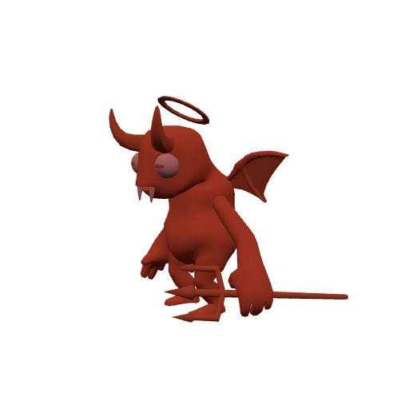
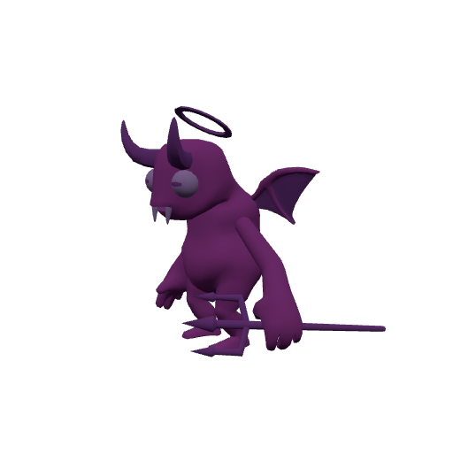

# Warlock demons

The Warlock fights alongside a summoned demon. Each fills a different role — pick by what the fight needs. Stats below are the demon's base; they scale with you as you level.

## Emberkin

| Stat | Value |
|---|---|
| Base health | 30 (+12/level) |
| Base damage | 5 (+1.1/level) @ 2s |
| Size | tiny (×0.55) |

## Gloomshade

| Stat | Value |
|---|---|
| Base health | 70 (+28/level) |
| Base damage | 4 (+0.75/level) @ 2s |
| Size | large (×1.15) |

## Duskborn

| Stat | Value |
|---|---|
| Base health | 34 (+14/level) |
| Base damage | 7 (+2.1/level) @ 1.7s |
| Size | normal (×0.95) |

## Spellhound

| Stat | Value |
|---|---|
| Base health | 46 (+18/level) |
| Base damage | 6 (+1.7/level) @ 2s |
| Size | normal (×1) |

## Warfiend

| Stat | Value |
|---|---|
| Base health | 80 (+30/level) |
| Base damage | 7 (+2/level) @ 2.2s |
| Size | large (×1.25) |

## Pyre Colossus

| Stat | Value |
|---|---|
| Base health | 130 (+42/level) |
| Base damage | 10 (+2.6/level) @ 2.8s |
| Size | huge (×1.7) |

## Wraithborn

| Stat | Value |
|---|---|
| Base health | 95 (+34/level) |
| Base damage | 11 (+2.4/level) @ 2.4s |
| Size | huge (×1.5) |
